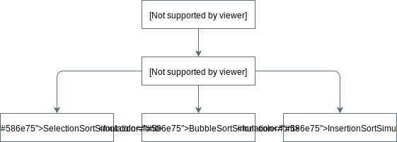

## Introduction

Algorithm Visualization is a program implemented in JavaFX that was created
to be an easily extendable program for visualizing various algorithms. The
program was developed using object oriented techniques for maximizing code
reuse. At the base of everything is a 2D canvas that can be used in
visualizing many things, not just algorithms. Therefore while this program
shows off its capabilities with algorithms, it can be extended to any
2D simulation that can be thought up.

***** Put a video of program running. *****

## Object Oriented Design

The main classes in the initial implementation for sorting shown in the
following image, where Simulation and SortSimulation are abstract classes:

    

Success with this setup comes from the distribution of what is computed at
each level. Simulation considers only the color scheme and the canvas with
which to draw upon. SortSimulation contains the data that all sorting
algorithms require (a list to sort), and different parameters for how to
display the image onto a canvas. Both Simulation and SortSimulation are
abstract classes. The final round of simulation classes implement various
sorting algorithms. Due to the layout of the classes, at this final level
the code can focus solely on manipulating the data within the SortSimulation
class since it extends it. It is here that the biggest benefit of this
layout becomes apparent, after handling the complexities of getting the
simulation onto the screen, focus at the last layer is just on implementing
the algorithm in question.

## Future Extension for Other Simulations

While all that is implemented at the moment is sorting algorithms, other
algorithms can easily be visualized. To start with just an extension of
Simulation is required in much the spirit that SortSimulation is
implemented. After that following the spirit of the different sorting
algorithms, extension of SortSimulation would allow focusing on the
logic of the new algorithm.
