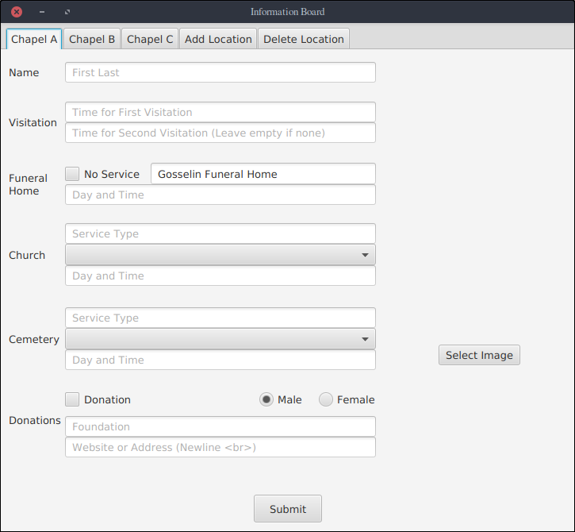

[GitHub](https://github.com/temorris87/InformationBoard)

## Introduction

The Information Board project is one that was born for the idea of making it
easier to obtain information regarding funeral services at Gosselin Funeral
Home when I was employed there. In the image below is what can be seen when
you first enter Gosselin Funeral Home at the moment:

 

    

 

## Reason for Implementation

This project was born from the idea of making it easier for people to find 
information when attending a service. The old method of propagating information
had four picture frames. In the lobby right where the Information Board is now,
was a picture frame which contained the names of those having a service.
Itemized details of the service were held in individual picture frames within
each of the chapels.

For most people who came into the funeral home, it was not obvious where to go
with this setup. In many cases the main frame was not visible and an employee
would have to direct them to the individual chapel. Many people also had
problems reading the paper signs because the fonts were not as big due to the
limitation of having three signs up in a picture frame simultaneously.

From a labor perspective it was also more difficult. Each day after services
were complete, the signs would have to be tore down. Before each service the
next sign would have to be put up. The design of this Information Board
allows the update of the screen to occur from a computer. The user who puts
up the information can also preview the page locally on the computer without
having to go to the lobby to view the page.

## Implementation Specifics

The Information Board consists of a java program with a GUI interface that
allows updating information for all of the chapels. In the backend is also
a serialized array that is written to a file to allow persistant update and
reuse of common locations and their addresses. The interface is shown in the
following image:

 

    

 

Attached to the local network is a Raspberry Pi which keeps Firefox loaded
and in kiosk mode. A plugin was found that refreshes the page when the source
code changes. For communication with the Raspberry Pi, the central computer
for updating the board was connected remotely to the file system of the
Raspberry Pi. A position for the source code was hard coded and the Java
program writes to this location. In this way, there is no need to have a
client server model. When the Raspberry Pi comes online, Windows automatically
connects to the filesystem.

The Java program itself is written in such a way to generate the source code
for the html page. Each day for services, there is a possibility to use
0 - 3 chapels. Therefore the program was designed to be visually appealing
for 1 - 3 chapels in use. HTML code is produced in such a way that the
page is centered vertically. For 3 chapels in use, the funeral home logo
disappears to make room for the additional information.

## Update on Success

The Information Board has been up around the clock for over a year now and
there has only been two problems. One day there was a thunder storm that
caused Raspberry Pi to shut off, and Firefox was not willing to reload the
page automatically. In this case the fix was simple.

A different problem that surfaced was one situation where there was three
funerals. One of the addresses extended over two lines and the display
was not big enough to hold all of the information. This was fixed by
adjusting the font sizes slightly. Now when you walk in, the name is
visible and readable to most from the door. The itemized details must be
read closer to the board. This is a good solution still because when people
walk in they quickly can see where to go, while those who want more
information can approach it to get more.
